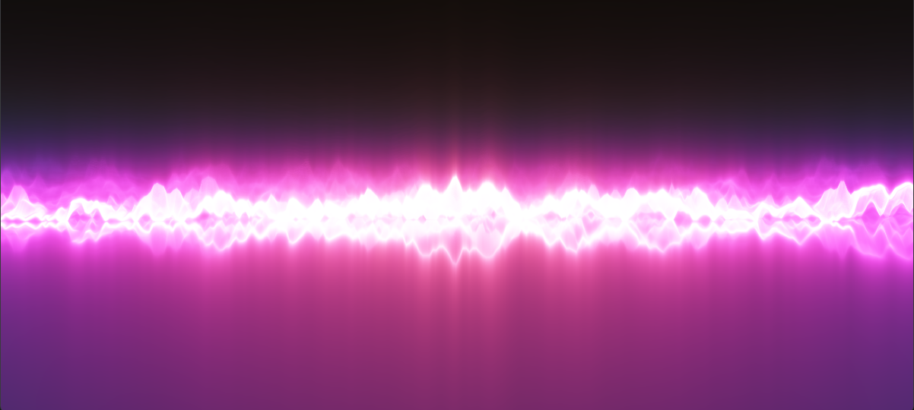

<p align="center">
  
</p>

# Audio Visualizer

A ray marched audio visualizer built using **Rust**, **eframe (egui + wgpu)**, **rodio**, and **rustfft**. It also has persistent state, mostly :P
Drag and drop an audio file and everything should start automatically.

## Installation & Setup

1. Make sure you have the [Rust toolchain](https://rustup.rs/) installed.
2. Clone or navigate to the repository directory.

## Running the Application

```bash
python run.py
```

Or run via Cargo:

```bash
cargo run --release
```

## Rendering a video

Drop in an audio file, hover the controls and hit **🎬 Export** to render the visualizer
and that track into an MP4 (H.264 + AAC). The render happens offline on its own headless
GPU device, so it's frame-exact regardless of how fast your machine draws it, and it uses
whatever visual settings (FFT/waveform, gain, window, phase lock) the live view is using
when you press *Render MP4*.

This needs [**ffmpeg**](https://ffmpeg.org/download.html) on your PATH.

By default the export uses your GPU's video encoder (NVENC / QSV / AMF) if one is
actually working on your machine, which is what keeps the export GPU-bound instead of
encoder-bound — on a GTX 1070 at 1080p60 that's **~130 frames/sec vs ~38** for x264,
at matched quality and file size. Pick **CPU (x264)** in the export window if you want
the last few percent of compression instead.

The same thing works from the command line, without opening a window:

```bash
audio-visualizer --render song.mp3 --size 1920x1080 --fps 60
```

```
  -o, --out <file.mp4>   Output file (default: <audio>_visualizer.mp4)
      --size <WxH>       Video size (default: 1920x1080)
      --fps <n>          Frame rate (default: 60)
      --crf <n>          Quality, lower is better (default: 18)
      --encoder <e>      auto | gpu | cpu  (default: auto — hardware if available)
      --speed <s>        x264 preset: fast | balanced | best (default: balanced)
      --fft              Use the FFT + wave mode instead of waveform only
      --gain <f>         Visual gain (default: 1.0 waveform / 4.0 with --fft)
      --window <ms>      Waveform window in ms (default: 70)
      --no-trigger       Disable zero-crossing phase lock
```

### You could download the binary from the releases. If you go that route:

If Windows SmartScreen warns you with *"Windows protected your PC"* when downloading or running the compiled `.exe`:
1. Click **"More info"**.
2. Click **"Run anyway"**.

This warning appears because the binary is compiled locally / open-source and is not signed with a paid developer certificate.
